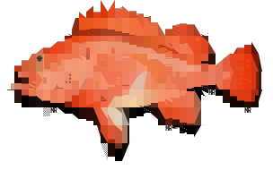
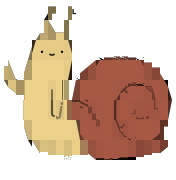
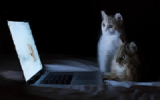
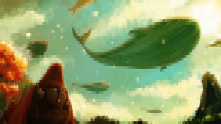

<h1>ANSI🔥Art</h1>

Original <a href="https://en.wikipedia.org/wiki/ANSI_art">ANSI Art</a> is typically limited to
  <a href="https://en.wikipedia.org/wiki/ANSI_escape_code#3-bit_and_4-bit">16 colors</a> and the
  character set used by the original <a href="https://www.youtube.com/watch?v=_mZBa3sqTrI&t=1061s">IBM PC</a>.

<a href="https://en.wikipedia.org/wiki/ANSI_art">ANSI Art</a> ogranicza się zwykle do
  <a href="https://en.wikipedia.org/wiki/ANSI_escape_code#3-bit_and_4-bit">16 kolorów</a> oraz zestawu
  znaków z oryginalnego <a href="https://www.youtube.com/watch?v=_mZBa3sqTrI&t=1061s">IBM PC</a>.

Times have changed. Modern terminal emulators support 24-bit RGB colors & can display arbitrary
  Unicode characters. This opens entirely new possibilities for the art that can be displayed in the terminal.

Czasy się zmieniły. Współczesne terminale obsługują 24-bitowy kolor i mogą wyświetlać dowolne
  znaki Unikodu. Otwiera to zupełnie nowe możliwości dla ANSI Artu wyświetlanego w terminalu.

<audio controls style="float: right"><source src="624425__foleyhaven__fire-burning-03.ogg" type="audio/ogg"></audio>Let's call this 24-bit, Unicode-capable version of ANSI Art, an <strong>ANSI🔥Art</strong> (pronounced
  just like a regular ANSI Art, although with a sound of blazing fire in the background).

<audio controls style="float: right"><source src="624425__foleyhaven__fire-burning-03.ogg" type="audio/ogg"></audio>Nazwijmy ten 24-bitowy, Unikodowy ANSI Art jako <strong>ANSI🔥Art</strong> (wymawiane
  jak zwykły ANSI Art, ale z odgłosem płomieni w tle).

ANSI🔥Art can be used in the output of interactive <a href="https://www.youtube.com/watch?v=_oHByo8tiEY">CLI</a>
  commands, <a href="http://mewbies.com/how_to_customize_your_console_login_message_tutorial.htm">SSH MOTD</a>, an
  element of a <a href="https://www.youtube.com/watch?v=4G_cthFZeJ8">ncurses</a> interface or even for
  <a href="https://www.youtube.com/watch?v=MJZvWgcxV0M">animation</a>.

ANSI🔥Art może zostać wykorzystany na wyjściu interaktywnych <a href="https://www.youtube.com/watch?v=_oHByo8tiEY">poleceń terminala</a>, jako <a href="http://mewbies.com/how_to_customize_your_console_login_message_tutorial.htm">MOTD w SSH</a>, jako
  element interfejsu <a href="https://www.youtube.com/watch?v=4G_cthFZeJ8">ncurses</a> lub nawet jako element
  <a href="https://www.youtube.com/watch?v=MJZvWgcxV0M">animacji</a>.

Here are some examples of what can be achieved:

Oto kilka przykładów co można osiągnąć:

This website allows you to render a regular image as an ANSI🔥Art. Just drop your image / TTF font of choice onto this webpage & click the <em>Render</em> button below.

Poniższa strona pozwala na konwersję dowolnego obrazu na ANSI🔥Art. Przeciągnij wybrany obraz / czcionkę TTF na tą stronę, a następnie kliknij przycisk <em>Renderuj</em> poniżej.

For those, who know how to git pull & push, there is also a <a href="https://github.com/mafik/ansi-art">C++ library</a> for rendering ANSI🔥Art.

Dla tych, którzy wiedzą co to <code>git pull</code> i <code>push</code>, dostępna jest także <a href="https://github.com/mafik/ansi-art">biblioteka C++</a> do renderowania ANSI🔥Art-u.

<h2 lang="en">1. Image selection</h2>
<h2 lang="pl">1. Wybór obrazu</h2>

You can drop an image anywhere on this page or open an image by clicking the button below.

Możesz upuścić obraz gdziekolwiek na tej stronie. Alternatywnie możesz też kliknąć przycisk "Wybierz plik" poniżej.

  

<input id="image-input" type="file" onchange="ImageInputChanged(event);">

<h2 lang="en">2. Font selection</h2>
<h2 lang="pl">2. Wybór czcionki</h2>

You can drop a TTF file anywhere on this page. Alternatively click the button below to open a TTF file.

Podobnie jak z obrazem, czcionkę TTF możesz zwyczajnie przeciągnąć na stronę. Alternatywnie możesz też kliknąć przycisk "Wybierz plik" poniżej.

Various fonts offer different character support. They also have different glyphs & aspect ratio.
For optimal results upload the TTF file of the font used to display the ANSI Art. By default
<a href="https://juliamono.netlify.app/">Julia Mono</a> will be used.

Różne czcionki obsługują nieco inne zestawy znaków. Różnią się też (oczywiście) kształtem znaków oraz wysokością linii.
Dla optymalnych rezultatów, dobrze jest wybrać dokładnie taką czcionkę, jaka będzie użyta do wyświetlenia ANSI Artu. Domyślny wybór to <a href="https://juliamono.netlify.app/">Julia Mono</a>.

Note that only fixed-width characters will be used. Most of variable-size fonts will not work.

Poniższy konwerter obsługuje jedynie znaki o stałej szerokości. Większość czcionek o zmiennej szerokości znaku nie zadziała.

  
No font loaded. Probably the script didn't load yet (or maybe it crashed - check the JS console to find out).

<input id="font-input" type="file" onchange="FontInputChanged(event);">

<h2 lang="en">3. Settings</h2>
<h2 lang="pl">3. Ustawienia</h2>

  <h3 lang="en">Forbidden characters</h3>
  <h3 lang="pl">Zabronione znaki</h3>
  
Some terminals replace specific characters with built-in images.
    This may break the alignment of ANSI Art. By default we're excluding
    the characters which are overridden on the Ubuntu OS.

  
Niektóre terminale zastępują pewne znaki wbudowanymi obrazami.
    Może to zepsuć wyrównanie ANSI Art-u. Domyślnie więc wykluczamy
    znaki, które zastępowane są na systemie Ubuntu.

  <textarea id="forbidden_characters_textarea" onchange="ForbiddenChanged(event);">⬛⬜⏪⏩⏫⏬⚡⚪⚫⭐⭕🆎🆑🆒🆓🆔🆕🆖🆗🆘🆙🆚🌑🌒🌓🌔🌕🌖🌗🌘❌</textarea>

  <h3 lang="en">Colors</h3>
  <h3 lang="pl">Kolory</h3>
  <select id="color-select" onchange="ColorSetChanged(event);">
    <option lang="en" value="0">24-bit color</option>
    <option lang="pl" value="0">kolor 24-bitowy</option>
    <option lang="en" value="1">8-bit color</option>
    <option lang="pl" value="1">kolor 8-bitowy</option>
    <option lang="en" value="2">0-bit (white on black)</option>
    <option lang="pl" value="2">biały tekst na czarnym tle</option>
    <option lang="en" value="3">0-bit (black on white)</option>
    <option lang="pl" value="3">czarny tekst na białym tle</option>
  </select>

  <h3 lang="en">Width</h3>
  <h3 lang="pl">Szerokość</h3>
  <input type="number" id="size-width" min="1" step="1" value="80" onchange="WidthChanged(event);">

  <button id="render-button">RenderRenderuj</button> 
  <progress id="progress" max="100" value="0"> 100% </progress>

  
Preview:

  
Podgląd:

  <canvas id="result-canvas" style="background-color: #888;"></canvas>
  
C-escaped string:

  
Stała języka C:

  <textarea id="result-c"></textarea>
  
Bash-escaped string:

  
Polecenie powłoki Bash:

  <textarea id="result-bash"></textarea>
  
Raw unicode string:

  
Unikod:

  <textarea id="result-raw"></textarea>

