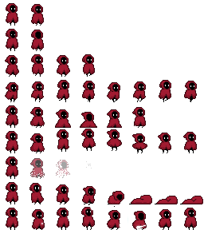

<h1>LibColony</h1>

<p lang="en">LibColony is a C++ (and JavaScript) library for task sheduling, perfect for colony simulation games like Rimworld or Dwarf Fortress. LibColony reduces the need for micromanagement, increases autonomy of colonists and prevents spirals of death. As a result the player can focus on planning rather than firefighting.</p>
<p lang="pl">LibColony to biblioteka C++ (i JavaScript) do planowania zadań w grach symulujących kolonie. Jest to odpowiedź na problem, który występuje w grach typu Dwarf Fortress albo Rimworld, a polegający na tym, że zachłanny algorytm przydzielania zadań reagując na drobne incydenty prowadzi do spiral zagłady.</p>

<p lang="pl">LibColony ogranicza potrzebę interwencji gracza oraz zwięsza autonomiczność kolonistów. W efekcie gracz może skupić się na planowaniu kolonii, a nie na gaszeniu pożarów.</p>

<h2><a href="#demo">Demo ↴</a></h2>

<h2 lang="en">Introduction</h2>
<h2 lang="pl">Wprowadzenie</h2>

<div style="text-align: center; display: inline-block; float: right; width: 33%; min-width: 200px; position: relative;">
<video width="100%" autoplay muted loop>
  <source src="5QZ28h8Gosg.webm" type="video/webm">
</video><span style="background: rgba(255, 255, 255, 0.7); position: absolute; bottom: .5em; right: .5em">Video: <a href="https://www.youtube.com/@BlindiRL">BlindiRL</a></span></div>

<h3 lang="en">Colony simulators</h3>
<h3 lang="pl">Symulatory kolonii</h3>

<p lang="en">Gameplay in games like Dwarf Fortress or Rimworld usually involves planning a colony - the layout of buildings, workshops and houses. This is done with a great deal of freedom. For example, we can decide that our colony will be an isolated toy factory, an inn on a popular trade route, or a bandit camp.</p>
<p lang="pl">Rozgrywka w grach typu Dwarf Fortress albo Rimworld zwykle polega na planowaniu kolonii - układu budynków, warsztatów i domów. Odbywa się to z dużą dozą dowolności. Możemy na przykład zdecydować, że nasza kolonia będzie odizolowaną od cywilizacji fabryką zajmującą się produkcją zabawek, karczmą na popularnym szlaku handlowym, czy też obozem bandytów.</p>

<p lang="en">One of the most interesting elements that distinguishes this genre of games is that the built colony can actually be left alone. Its inhabitants take care of their own needs. The player can take on the role of a passive observer - like in an ant colony - following the fate of his subjects.</p>
<p lang="pl">Jednym z ciekawszych elementów, który odróżnia ten gatunek gier jest to, że zbudowaną kolonię można właściwie pozostawić samą sobie. Jej mieszkańcy sami dbają o swoje potrzeby. Gracz może wcielić się w pasywnego obserwatora - niczym w kolonii mrówek - śledzić losy swoich poddanych.</p>

<h3 lang="en">Death spiral</h3>
<h3 lang="pl">Spirala zagłady</h3>

<p lang="en">At least that's how it looks in theory. In practice, colonies are often annihilated for trivial reasons. Most often revolts caused by unmet needs of colonists - lack of food, protection from the elements or growing frustration. Tasks essential to the operation of the colony, such as maintaining fortifications or producing food, are routinely neglected.</p>
<p lang="pl">Tak przynajmniej wygląda to w teorii. W praktyce kolonie często ulegają zagładzie z błachych powodów. Najczęściej buntów spowodowanych niezaspokojeniem potrzeb kolonistów - brakowi jedzenia, ochrony przed żywiołami czy też narastającej frustracji. Istotne dla działania kolonii zadania, takie jak utrzymanie fortyfikacji czy produkcja jedzenia są rutynowo zaniedbywane.</p>

<p lang="en">Problems tend to develop in spirals - they start with a single disgruntled character who destroys something in anger, spoiling the mood of subsequent colonists. Therefore, player intervention is constantly needed, reminding colonists what to do, and putting out fires while they are still manageable.</p>
<p lang="pl">Problemy mają tendencję do rozwoju spiralnego - zaczynają się od pojedynczej niezadowolonej postaci, która w złości coś niszczy, psując nastroje kolejnych kolonistów. Dlatego ciągle potrzebna jest interwencja gracza, przypominającego kolonistom co mają robić, oraz gaszącego pożary, kiedy te są jeszcze do opanowania.</p>

<p lang="en">This mechanism, known as the <em>death spiral</em>, follows a certain well-known pattern. It relies on the fact that minor incidents generate additional tasks - both completely unimportant and <em>vital</em> to the survival of the colony. The insignificant tasks immediately consume the colonists, while the few vital tasks remain unperformed. This causes problems to grow and inevitably leads to further incidents. Chaos ensues.</p>
<p lang="pl">Mechanizm ten, zwany <em>spralą zagłady</em> postępuje zgodnie z pewnym dobrze znanym schematem. Polega on na tym, że drobne incydenty generują dodatkowe zadania - zarówno zupełnie nieistotne, jak i <em>kluczowe</em> dla przetrwania kolonii. Nieistotne zadania pochłaniają natychmiast kolonistów, natomiast te kilka kluczowych zadań pozostaje niewykonanych. Powoduje to narastanie problemów i nieuchronnie prowadzi do dalszych incydentów. Ma miejsce efekt lawinowy.</p>

<p lang="en">What becomes clear is that the problem is primarily the way tasks are assigned to colonists. It involves a character who has free time checking a list of tasks and choosing something from it for themself. In doing so, it does not take into account the tasks performed by other characters. The decision is made "locally", based on a schedule and the work rules set by the player - that's why this approach is called "greedy". The selected task is reserved (reservations prevent other characters from taking over the task). The colonist then performs it until something gets in his way, or until the task gets completed. This simple and seemingly obvious algorithm leads to a series of problems and is the basis of the death spiral.</p>
<p lang="pl">Oczywistym staje się to, że problem stanowi przede wszystkim sposób przydzielania zadań do kolonistów. Polega on na tym, że postać, która ma wolny czas sprawdza listę zadań i wybiera z niej coś dla siebie. Nie bierze pod uwagę przy tym zadań wykonywanych przez inne postaci. Decyzja podejmowana jest "lokalnie", na podstawie jej harmonogramu oraz reguł pracy ustalonych przez gracza - dlatego podejście to nazywane jest "zachłannym". Wybrane zadanie jest rezerwowane (rezerwacje uniemożliwiają innym postaciom przejęcie zadania). Następnie wykonuje je aż coś jej nie przeszkodzi, albo doprowadzi zadanie do końca. Ten prosty i z pozoru oczywisty algorytm prowadzi do szeregu problemów i stanowi podstawę spirali zagłady.</p>

<p lang="en">Given the above problems, and the fact that the intervention of a player directing the colonists' movements meticulously can prevent a death spiral, we can make the following claim:</p>
<p lang="pl">Biorąc pod uwagę powyższe problemy oraz to, że interwencja gracza kierującego drobiazgowo ruchami kolonistów może zapobiec spirali zagłady możemy wysunąć następujące twierdzenie:

<p lang="en"><strong>An appropriate assignment algorithm can counteract death spirals on an ongoing basis by meeting the needs of colonists and repairing the effects of minor incidents.</strong></p>
<p lang="pl"><strong>Odpowiednii algorytm przydzielania zadań może przeciwdziałać spiralom zagłady na bieżąco zaspokajając potrzeby kolonistów oraz naprawiając skutki drobnych incydentów.</strong></p>

<p lang="en">In other words - do exactly what a firefighting player does.</p>
<p lang="pl">Innymi słowy - robić dokładnie to, czym zajmuje się gaszący pożary gracz.</p>

<p lang="en">A few years ago, while taking part in a programming competition (and winning 😎) I had the opportunity to write a program that flexibly assigns such tasks. Therefore, I decided to dig up the old code, develop it and release it as a library. I provide a description of its operation, and the source code (under the MIT license) below.</p>
<p lang="pl">Kilka lat temu, biorąc udział w zawodach programistycznych (i wygrywając 😎) miałem okazję napisać program elastycznie przydzielający takie zadania. Dlatego postanowiłem odgrzebać stary kod, opracować go i wydać jako bibliotekę. Opis jej działania, oraz kod źródłowy udostępniam (na licencji MIT) poniżej.</p>

<h3 lang="en">Problems of greedy task allocation</h3>
<h3 lang="pl">Problemy zachłannego przydziału zadań</h3>

<p lang="en">Greedy assignment of tasks leads to several problems. Let's list them:</p>
<p lang="pl">Zachłanne przydzielanie zadań prowadzi do kilku problemów. Wymieńmy je:</p>

<ol lang="en">
<li>During work, colonists do not take breaks and completely ignore their needs. Long tasks significantly increase their frustration.</li>
<li>A colonist reserving a task for himself prevents other, better positioned colonists from taking over. Therefore, even if a colonist is at the other end of the map and faces a long trek, he will not give the task to another colonist idling nearby.</li>
<li>A group of small tasks located far from the colony often results in the escapade of entire groups of colonists (each reserving one of the distant tasks for themselves). Despite the fact that it would be enough for one of them to go.</li>
<li>Some colonists are simply better at certain tasks than others. In order for the greedy algorithm to assign them the right jobs, the player must create appropriate work rules that prohibit the others from the given jobs. Such rules must be updated as colonists join and leave the colony, requiring constant intervention by the player.</li>
<li>Minor tasks, are often ignored by colonists who pass right by them and could have done them virtually immediately. Instead, they are left for later - and then require another colonist to make a long trip to the site.</li>
<li>A colonist with special requirements, such as needing more entertainment at the moment, has the same amount of free time as others. Such colonists require special care from the player, who adjusts their time accordingly.</li>
</ol>
<ol lang="pl">
<li>W czasie pracy koloniści nie robią przerw i całkowicie ignorują swoje potrzeby. Długie zadania istotnie zwiększają ich frustrację.</li>
<li>Kolonista rezerwując sobie zadanie uniemożliwia innym, lepiej usytuowanym kolonistom przejęcie go. Dlatego nawet jeśli kolonista jest na drugim końcu mapy i czeka go długa wędrówka, nie odda zadania bezczynnemu koloniście stojącemu na miejscu.</li>
<li>Grupa drobnych zadań zlokalizowanych daleko od kolonii często powoduje eskapadę całych grup kolonistów (każdy rezerwuje sobie po jednym z odległych zadań). Pomimo, że wystarczyłoby, żeby wybrał się jeden z nich.</li>
<li>Niektórzy koloniści są zwyczajnie lepsi w pewnych zadaniach od innych. Aby zachłanny algorytm przydzielił im odpowiednie prace gracz musi stworzyć odpowiednie reguły pracy, które zabronią pozostałym danych prac. Reguły takie muszą być aktualizowane w miarę jak koloniści dołączają i opuszczają kolonię, wymagając ciągłych interwencji gracza.</li>
<li>Drobne zadania, są często ignorowane przez kolonistów którzy przechodzą tuż obok nich i mogliby wykonać je właściwie natychmiast. Zamiast tego są pozostawiane na później - a później wymagają od innego kolonisty długiej podróży na miejsce.</li>
<li>Kolonista mający szczególne wymagania, na przykład potrzebujący w danej chwili więcej rozrywki, posiada taką samą ilość wolnego czasu jak inni. Koloniści tacy wymagają specjalnej opieki gracza, który odpowiednio dostosowuje ich czas pracy.</li>
</ol>

<h2 lang="en">LibColony algorithm</h2>
<h2 lang="pl">Algorytm LibColony</h2>

<h3 lang="en">Performance</h3>
<h3 lang="pl">Wydajność</h3>

<p lang="en">One of the most important factors for gamedev libraries is their speed. If they are not fast enough, game developers will rewrite them for their own use in a more efficient way. That's why LibColony is written in high-performance C++, with the ability to call from other languages. For the demonstration at mrogalski.eu, I wrote the corresponding interface in JavaScript. This way it can be used both in games written in C++ and in games written in JavaScript.</p>
<p lang="pl">Jednym z najistotniejszych czynników dla bibliotek gamedev-owych jest ich szybkość. Jeśli nie są dość szybkie, to autorzy gier będą je przepisywać na własne potrzeby w sposób bardziej wydajny. Dlatego też LibColony jest napisana w wysoko wydajnym języku C++, z możliwością wywołania z innych języków. Na potrzeby demonstracji na mrogalski.eu napisałem odpowiedni interfejs w JavaScript. W ten sposób można ją używać zarówno w grach napisanych w C++ jak i w grach napisanych w JavaScript.</p>

<p lang="en">The algorithm itself avoids any allocations, operating only on the stack, as well as any system calls. In this way, it avoids both of the biggest sources of slowdown, and makes efficient use of the processor's cache.</p>
<p lang="pl">Sam algorytm unika jakichkolwiek alokacji, działając wyłącznie na stosie, a także jakichkolwiek wywołań systemowych. W ten sposób unika obu największych źródeł spowolnienia oraz skutecznie wykorzystuje pamięć podręczną procesora.</p>

<h3 lang="en">Recalculation every frame</h3>
<h3 lang="pl">Przeliczanie co klatkę</h3>

<p lang="en">Thanks to its high performance, LibColony is able to recalculate task assignments multiple times (yes!) per frame of animation, even when the number of colonists and tasks reaches hundreds. This allows colonists to react immediately to changes in the game world, as well as for (described later) long-term planning.</p>
<p lang="pl">Dzięki wysokiej wydajności LibColony jest w stanie przeliczać przydział zadań wielokrotnie (tak!) w ciągu jednej klatki animacji, nawet jeśli liczba kolonistów oraz zadań sięga setek. Pozwala to na natychmiastową reakcję kolonistów na zmiany w świecie gry, a także na (opisane dalej) planowanie długoterminowe.</p>

<h3 lang="en">Uniform treatment of needs and tasks</h3>
<h3 lang="pl">Jednorodne traktowanie potrzeb i zadań</h3>

<p lang="en">LibColony satisfies colonists' needs by treating them analogously to tasks. As a character's need grows in importance, its priority gradually increases. As a result, colonists are able to interrupt work to meet their needs. The distance from where the need is met is also taken into account. By this, for example, colonists who work near the kitchen will eat more often than colonists working in remote corners of the colony.</p>
<p lang="pl">LibColony zaspokaja potrzeby kolonistów traktując je analogicznie do zadań. W miarę jak potrzeba postaci rośnie na znaczeniu, stopniowo wzrasta jej priorytet. Dzięki temu koloniści są w stanie przerwać pracę by zaspokoić swoje potrzeby. Brana pod uwagę jest też odległość od miejsca, w którym spełniona jest dana potrzeba. Przez to na przykład koloniści, którzy pracują w pobliżu kuchni będą jeść częściej niż koloniści pracujący w odległych zakątkach kolonii.</p>

<p lang="en">In general, the following are taken into account:</p>
<p lang="pl">Ogólnie rzecz biorąc uwzględniane są:</p>

<ul lang="en">
<li>travel time to the task location</li>
<li>time to complete the task</li>
<li>risk of failure, after which a repeat of the task will be required</li>
<li>relative priority/importance of the task</li>
</ul>
<ul lang="pl">
<li>czas podróży do miejsca wykonania zadania</li>
<li>czas wykonania zadania</li>
<li>ryzyko porażki, po której wymagane będzie ponowienie zadania</li>
<li>względny prioritytet/istotność zadania</li>
</ul>

<p lang="en">The last element is particularly important because it allows game developers to distinguish key tasks from unimportant ones. This can include, for example:</p>
<p lang="pl">Ostatni element jest szczególnie istotny gdyż pozwala autorom gier odróżnić zadania kluczowe od tych nieistotnych. Można tu uwzględnić na przykład:</p>

<ul lang="en">
<li>whether a given cleaning task is located in a place where colonists frequent, or is far away from them (and thus less important).</li>
<li>whether adequate food supplies are available, or whether food is running out (and thus cooking tasks are more relevant)</li>
<li>the value / rarity of war spoils to be collected from the battlefield</li>
<li>etc. etc.</li>
</ul>
<ul lang="pl">
<li>czy dane zadanie sprzątania znajduje się w miejscu gdzie często bywają koloniści, czy też jest daleko od nich (i przez to jest mniej istotne)</li>
<li>czy dostępne są odpowiednie zapasy żywności, czy też jedzenie się kończy (i przez to zadania gotowania są bardziej istotne)</li>
<li>wartość / rzadkość łupów wojennych do zebrania z pola bitwy</li>
<li>itd. itp.</li>
</ul>

<p lang="en">Each of these elements can take on different values for each colonist and change over time.</p>
<p lang="pl">Każdy z tych elementów może przyjmować różne wartości dla każdego kolonisty oraz ulegać zmianom w czasie.</p>

<h3 lang="en">Hungarian algorithm</h3>
<h3 lang="pl">Algorytm węgierski</h3>

<p lang="en">The heart of the algorithm is the <a href="https://en.wikipedia.org/wiki/Hungarian_algorithm">Hungarian algorithm</a>, which guarantees optimal assignment of tasks to characters. Its complexity is O(n^3), although LibColony offers an optional (and rarely required) optimization that limits the number of assignments considered, so that the complexity drops to O(n^2).</p>
<p lang="pl">Sercem algorytmu jest <a href="https://en.wikipedia.org/wiki/Hungarian_algorithm">algorytm węgierski</a>, który gwarantuje optymalne przypisanie zadań do postaci. Jego złożoność wynosi O(n^3), choć LibColony oferuje opcjonalną (i rzadko wymaganą) optymalizację ograniczającą liczbę rozważanych zadań, dzięki czemu złożoność spada do O(n^2).</p>

<h3 lang="en">Delivery scheduling</h3>
<h3 lang="pl">Planowanie dostaw</h3>

<p lang="en">To schedule delivery tasks, the algorithm can be run twice. In the first run, it assigns items to locations where they are to be delivered. This allows it to determine the delivery cost for each item (while minimizing the total time for all deliveries). Then the algorithm is run again, this time assigning delivery tasks to the colonists who are to deliver them.</p>
<p lang="pl">Aby zaplanować zadania dostawy, algorytm może zostać uruchomiony dwukrotnie. W pierwszym przebiegu przypisuje on przedmioty do lokalizacji, gdzie mają zostać dostarczone. Pozwala to na ustalenie kosztu dostawy dla każdego przedmiotu (jednocześnie minimalizując łączny czas wszystkich dostaw). Następnie algorytm jest uruchamiany ponownie, tym razem przypisując zadania dostaw do kolonistów, którzy mają je dostarczyć.</p>

<h3 lang="en">Long-term planning</h3>
<h3 lang="pl">Planowanie długoterminowe</h3>

<p lang="en">Sometimes a single colonist can independently complete many tasks faster than many (slower) colonists. For example, when several small tasks occur in a remote location, a nearby colonist can complete them all faster than a group of colonists running from the other end of the map.</p>
<p lang="pl">Czasami pojedynczy kolonista może samodzielnie wykonać wiele zadań szybciej niż wiele (wolniejszych) kolonistów. Na przykład, gdy kilka małych zadań pojawia się w odległym miejscu, pobliski kolonista może wykonać je wszystkie szybciej niż grupa kolonistów biegnących z drugiego końca mapy.</p>

<p lang="en">This requires planning many tasks ahead, and LibColony can also help with this.</p>
<p lang="pl">Wymaga to zaplanowania wielu zadań w przyszłość i LibColony również może w tym pomóc.</p>

<p lang="en">To do this, first assign tasks in the usual way. This initial assignment will assign tasks to all available colonists - both nearby and distant. The trick is that the task that is completed first in this assignment is marked as completed; the colonist who completed it is moved (virtually) to the place where the task was completed, and the cost of all the tasks they can perform is increased by the cost of completing this just-completed task.</p>
<p lang="pl">Aby to zrobić, najpierw zadania przypisywane zą w zwykły sposób. To początkowe przypisanie przydzieli zadania wszystkim dostępnym kolonistom - zarówno tym pobliskim jak i odległym. Sztuczka polega na tym, że zadanie, które w tym przypisaniu jest ukończone jako pierwsze oznacza się jako ukończone; kolonistę, który je wykonał przemieszcza się (wirtualnie) na miejsce wykonania zadania, a koszty wszystkich wykonywanych przez niego zadań powiększane są o koszt wykonania tego właśnie ukończonego zadania.</p>

<p lang="en">The tasks are then assigned again and the whole process is repeated. The task completed first is marked as completed and the position and times of the other tasks of the colonist who completed it are corrected. This process can be repeated as many times as desired (within a certain time budget or until all tasks are completed).</p>
<p lang="pl">Następnie zadania przypisywane są ponownie i cały proces jest powtarzany. Zadanie wykonane jako pierwsze oznacza się jako ukończone oraz koryguje się pozycję oraz czasy pozostałych zadań kolonisty, który je wykonał. Proces ten może zostać powtórzony dowolną ilość razy (w ramach określonego budżetu czasowego lub do zakończenia wszystkich zadań).</p>

<p lang="en">The final long-term plan consists of the tasks that were completed during this process (assigned to colonists who completed them), followed by the tasks that were assigned to colonists in the last run of the algorithm.</p>
<p lang="pl">Ostateczny plan długoterminowy składa się z zadań, które zostały zakończone podczas tego procesu (przypisane do kolonistów, którzy je ukończyli), a następnie z zadań, które zostały przypisane do kolonistów w ostatnim przebiegu algorytmu.</p>

<h2 id="demo">Demo</h2>

<p lang="en">Below is a demo that shows how the library works. You can select different scenarios and see how LibColony handles them.</p>
<p lang="pl">Poniżej znajduje się demo, które pokazuje jak działa biblioteka. Możesz wybrać różne scenariusze i zobaczyć jak radzi sobie z nimi LibColony.</p>

<p lang="en">The C++ version is approx. 3 times faster than the WebAssembly version (embedded below).</p>
<p lang="pl">Wersja C++ jest ok. 3 razy szybsza od wersji WebAssembly (zagnieżdżonej poniżej).</p>


<canvas style="margin: 0 auto; display: block; max-width: 100%" id="canvas" width="640" height="480"></canvas>
<div style="float: right; margin: .5em"><span lang="pl">Grafika</span><span lang="en">Sprites</span>: <a href="https://penzilla.itch.io/hooded-protagonist">penzilla.itch.io</a></div>
<p><span lang="pl">Scenariusz</span><span lang="en">Scenario</span> <select id="stage">
  <option value="small">Random Small</option>
  <option value="medium">Random Medium</option>
  <option value="large">Random Large</option>
  <option value="huge">Random Huge</option>
  <option value="insane">Random Insane</option>
  <option value="row">Row</option>
  <option value="skewed row">Skewed row</option>
  <option value="that guy">That guy</option>
  <option value="circle">Circle</option>
  <option value="square">Square</option>
  <option value="inversed square">Inversed square</option>
</select></p>

<ul lang="en">
<li><em>Random Small</em> corresponds to the typical colony in the Rimworld game and the initial colony in Dwarf Fortress. In this scenario, you can see how 10 characters dynamically exchange tasks to complete them as quickly as possible.</li>
<li><em>Random Medium</em> corresponds to a typical colony in a Dwarf Fortress game after a few hours of play. This is more characters than are encountered in typical Rimworld games. As the number of characters and quests increases, LibColony continues to deftly swap between characters.</li>
<li><em>Random Large</em> corresponds to the advanced colony in the Dwarf Fortress game. In the Dwarf Fortress game, colonies of this size are associated with considerable lag. LibColony copes with this problem.</li>
<li><em>Random Huge</em> corresponds to the largest colonies possible in Dwarf Fortress (~250 characters). Gameplay in such colonies in Dwarf Fortress runs at a few frames per second. LibColony at this stage already requires more time than the typical animation frame budget (16.6ms). To use LibColony in games of this size, task scheduling is best done in a separate thread.</li>
<li><em>Random Insane</em> demonstrates LibColony's performance in huge colonies (500 characters, 2000 tasks).</li>
<li><em>Row</em> a simple test case where the optimal solution coincides with the greedy one. Each character runs to the nearest task.</li>
<li><em>Skewed row</em> a tricky scenario where the optimal solution requires characters to coordinate task allocation among themselves. In this case, the greedy algorithm is unable to find the optimal solution.</li>
<li><em>That guy</em> case demonstrating the usefulness of long-term planning and the problems of the greedy approach. A group of characters runs towards a group of tasks at the other end of the map, despite the fact that the character there can handle the tasks by himself anyway. A greedy planning algorithm would prevent the character located at the end of the map from taking away the other characters' reserved tasks. Long-term planning, on the other hand, would allow a group of characters to realize that there is no need to run anywhere because the tasks will be completed before they get there anyway.</li>
<li><em>Circle, Square, Inversed Square</em> a set of simple test cases.</li>
</ul>
<ul lang="pl">
<li><em>Random Small</em> odpowiada typowej kolonii w grze Rimworld oraz początkowej w Dwarf Fortress. W scenariuszu tym widać jak 10 postaci dynamicznie wymienia się zadaniami by jak najszybciej je zakończyć.</li>
<li><em>Random Medium</em> odpowiada typowej kolonii w grze Dwarf Fortress po kilku godzinach gry. Jest to więcej postaci niż spotyka się w typowych rozgrywkach Rimworld. W miarę wzrostu liczby postaci oraz zadań, LibColony dalej zręcznie wymienia je między postaciami.</li>
<li><em>Random Large</em> odpowiada zaawansowanej kolonii w grze Dwarf Fortress. W grze Dwarf Fortress kolonie o takim rozmiarze wiążą się ze sporymi lagami. LibColony radzi sobie z tym problemem.</li>
<li><em>Random Huge</em> odpowiada największym koloniom możliwym do uzyskania w Dwarf Fortress (~250 postaci). Rozgrywka w takich koloniach w Dwarf Fortress toczy się w tempie kilku klatek na sekundę. LibColony na tym etapie wymaga już więcej czasu niż typowy budżet klatki animacji (16.6ms). Aby korzystać z LibColony w grach o takim rozmiarze, planowanie zadań najlepiej wykonywać w osobnym wątku.</li>
<li><em>Random Insane</em> demonstruje działanie LibColony w olbrzymich koloniach (500 postaci, 2000 zadań).</li>
<li><em>Row</em> prosty przypadek testowy, gdzie optymalne rozwiązanie pokrywa się z zachłannym. Każda postać biegnie do najbliższego zadania.</li>
<li><em>Skewed row</em> podstępny scenariusz, gdzie optymalne rozwiązanie wymaga by postaci skoordynowały między sobą przydział zadań. W tym przypadku zachłanny algorytm nie jest w stanie znaleźć optymalnego rozwiązania.</li>
<li><em>That guy</em> przypadek demonstrujący przydatność planowania długoterminowego oraz problemy podejścia zachłannego. Grupa postaci biegnie w kierunku grupy zadań na drugim końcu mapy, pomimo, że znajdująca się tam postać i tak poradzi sobie z zadaniami sama. Zachłanny algorytm planowania uniemożliwiłby postaci znajdującej się miescu odebranie pozostałym postaciom zarezerwowanych przez nich zadań. Planowanie długoterminowe pozwoliłoby natomiast grupie postaci zorientować się, że nie ma potrzeby nigdzie biec bo i tak zadania zostaną zakończone zanim tam dobiegną.</li>
<li><em>Circle, Square, Inversed Square</em> zestaw prostych przypadków testowych.</li>
</ul>

<h2 lang="en">Download</h2>
<h2 lang="pl">Pobieranie</h2>

<p lang="en">LibColony is available under the MIT license. The latest version can be downloaded from <a href="https://github.com/mafik/libcolony">github.com/mafik/libcolony</a>.</p>
<p lang="pl">LibColony dostępne jest na licencji MIT. Najnowsza wersja może zostać pobrana z <a href="https://github.com/mafik/libcolony">github.com/mafik/libcolony</a>.</p>

<p lang="en">The C++ library is a single header that should be linked in (preferably) one translation unit. All functions are available in the `colony` namespace. Version 1.0 can be downloaded from <a href="colony.h">here</a>.</p>
<p lang="pl">Biblioteka C++ jest pojedynczym nagłówkiem, który powinien zostać zlinkowany w (najlepiej) jednej jednostce tłumaczenia. Wszystkie funkcje są dostępne w przestrzeni nazw `colony`. Wersja 1.0 może zostać pobrana <a href="colony.h">stąd</a>.</p>

<p lang="en">The JavaScript library wraps C++ code compiled as WebAssembly. Version 1.0, built for browsers, can be downloaded from <a href="colony_js.zip">here</a>. All provided functions are described in the <a href="https://github.com/mafik/libcolony/blob/main/src/colony_js_post.js">colony_js_post.js</a>. To use the library, you can use the following sample code:</p>
<p lang="pl">Biblioteka JavaScript opakowuje kod C++ skompilowany jako WebAssembly. Wersja 1.0, przeznaczona do przeglądarek może zostać pobrana <a href="colony_js.zip">stąd</a>. Wszystkie udostępnione funkcje opisane są w pliku <a href="https://github.com/mafik/libcolony/blob/main/src/colony_js_post.js">colony_js_post.js</a>. Aby skorzystać z biblioteki możesz użyć następującego przykładowego kodu:</p>

```
<script>
  var Module = {
    onRuntimeInitialized: function() {
      window.requestAnimationFrame(tick);
    }
  };

  function tick() {
    let assignments = [{ character: "John", task: "clean blood", cost: 10 },
                       { character: "Fred", task: "clean blood", cost: 15 },
                       { character: "John", task: "construct wall", cost: 20 },
                       { character: "Fred", task: "construct wall", cost: 10 }];
    let optimized = Module.optimize(assignments);
    console.log(optimized); // [{ character: "John", task: "clean blood", cost: 10 },
                            //  { character: "Fred", task: "construct wall", cost: 10 }]
    window.requestAnimationFrame(tick);
  }
</script>
<script src="colony.js"></script>
```

<script>
  var Module = {
    onRuntimeInitialized: function() {
      window.requestAnimationFrame(tick);
    }
  };

  let canvas = document.getElementById('canvas');
  let spritesheet = document.getElementById('spritesheet');
  let ctx = canvas.getContext('2d', {alpha:false});
  ctx.imageSmoothingEnabled = false;
  let characters = [];
  let tasks = [];

  let margin = 40;

  function stage_clear() {
    characters.length = 0;
    tasks.length = 0;
  }

  function stage_random(n_characters, n_tasks) {
    stage_clear();
    for (let i = 0; i < n_characters; i++) {
      characters.push({
        x: Math.round(Math.random() * (canvas.width - 2 * margin) + margin),
        y: Math.round(Math.random() * (canvas.height - 2 * margin) + margin)
      });
    }

    for (let i = 0; i < n_tasks; i++) {
      let t = 1 + Math.random() * 2;
      tasks.push({
        x: Math.round(Math.random() * (canvas.width - 2 * margin) + margin),
        y: Math.round(Math.random() * (canvas.height - 2 * margin) + margin),
        t: t,
        tmax: t
      });
    }
  }

  function stage_row() {
    stage_clear();
    let n = 15;
    for (let i = 0; i < n; i++) {
      characters.push({
        x: margin,
        y: margin + (canvas.height - 2 * margin) * i / (n-1)
      });
    }

    for (let i = 0; i < n; i++) {
      tasks.push({
        x: canvas.width - margin,
        y: margin + (canvas.height - 2 * margin) * i / (n-1),
        t: 2,
        tmax: 2
      });
    }
  }

  function stage_skew() {
    stage_clear();
    let n = 15;
    for (let i = 0; i < n; i++) {
      characters.push({
        x: margin + (canvas.width - 2 * margin) / 4 * i / (n),
        y: margin + (canvas.height - 2 * margin) / 2 * i / (n-1)
      });
    }

    for (let i = 0; i < n; i++) {
      tasks.push({
        x: canvas.width * 3 / 4 + (canvas.width - 2 * margin) / 4 * (i+1) / (n),
        y: margin + (canvas.height - 2 * margin) / 2 * (i / (n-1) + 1),
        t: 2,
        tmax: 2
      });
    }
  }

  function stage_that_guy() {
    stage_clear();
    let n = 10;
    for (let i = 0; i < n; i++) {
      characters.push({
        x: margin,
        y: margin + (canvas.height - 2*margin) * i / (n-1)
      });
    }
    characters.push({
      x: canvas.width - margin,
      y: margin
    });
    for (let i = 0; i < n; i++) {
      tasks.push({
        x: canvas.width - margin,
        y: margin + (canvas.height - 2*margin) * i / (n-1),
        t: 1,
        tmax: 1
      });
    }
  }

  function stage_circle() {
    stage_clear();
    let n = 50;
    let cx = canvas.width / 2;
    let cy = canvas.height / 2;
    let r = (Math.min(cx, cy) - margin);
    for (let i = 0; i < n; i++) {
      let x = Math.round(cx + r * Math.cos(i / n * Math.PI * 2));
      let y = Math.round(cy + r * Math.sin(i / n * Math.PI * 2));
      characters.push({
        x: x,
        y: y
      });
    }
    tasks.push({
      x: cx,
      y: cy,
      t: 5,
      tmax: 5
    });
  }

  function stage_square() {
    stage_clear();
    let n = 10;
    let cx = canvas.width / 2;
    let cy = canvas.height / 2;
    let r = (Math.min(cx, cy) - margin);
    for (let i = 0; i < n; i++) {
      characters.push({
        x: cx + r - 2*i/(n) * r,
        y: cy + r
      });
      characters.push({
        x: cx - r + 2*i/(n) * r,
        y: cy - r
      });
      characters.push({
        y: cy + r - 2*(i+1)/(n) * r,
        x: cx + r
      });
      characters.push({
        y: cy - r + 2*(i+1)/(n) * r,
        x: cx - r
      });
    }
    tasks.push({
      x: cx,
      y: cy,
      t: 5,
      tmax: 5
    });
  }

  function stage_square2() {
    stage_clear();
    let n = 10;
    let cx = canvas.width / 2;
    let cy = canvas.height / 2;
    let r = (Math.min(cx, cy) - margin);
    for (let i = 0; i < n; i++) {
      tasks.push({
        x: cx + r - 2*i/(n) * r,
        y: cy + r,
        t: 2,
        tmax: 2
      });
      tasks.push({
        x: cx - r + 2*i/(n) * r,
        y: cy - r,
        t: 2,
        tmax: 2
      });
      tasks.push({
        y: cy + r - 2*(i+1)/(n) * r,
        x: cx + r,
        t: 2,
        tmax: 2
      });
      tasks.push({
        y: cy - r + 2*(i+1)/(n) * r,
        x: cx - r,
        t: 2,
        tmax: 2
      });
    }
    for (let i = 0; i < 4*n; i++) {
      characters.push({
        x: cx,
        y: cy
      });
    }
  }

  let stages = {
    'small': () => stage_random(10, 50),
    'medium': () => stage_random(50, 100),
    'large': () => stage_random(150, 500),
    'huge': () => stage_random(250, 1000),
    'insane': () => stage_random(500, 2000),
    'row': () => stage_row(),
    'skewed row': () => stage_skew(),
    'that guy': () => stage_that_guy(),
    'circle': () => stage_circle(),
    'square': () => stage_square(),
    'inversed square': () => stage_square2(),
  }

  let stage_selector = document.getElementById('stage');
  stage_selector.addEventListener('change', (e) => {
    stages[e.target.value]();
  });

  let last_time = 0;
  let time_history = [];
  function tick(time) {
    window.requestAnimationFrame(tick);
    time /= 1000;
    let dt = time - last_time;
    last_time = time;

    let assignments = [];
    for (let character_i = 0; character_i < characters.length; character_i++) {
      for (let task_i = 0; task_i < tasks.length; ++task_i) {
        let c = characters[character_i];
        let t = tasks[task_i];
        let dist = Math.sqrt((c.x - t.x) * (c.x - t.x) + (c.y - t.y) * (c.y - t.y));
        let cost = Module.compute_cost({ travel_time: dist, work_time: t.t });
        assignments.push({ character: character_i, task: task_i, cost: cost });
      }
    }
    var startTime = performance.now()
    assignments = Module.optimize(assignments);
    var endTime = performance.now()
    time_history.push(endTime - startTime);
    if (time_history.length > 50) {
      time_history.shift();
    }

    for (let i = 0; i < characters.length; i++) {
      characters[i].animation = 'idle';
    }

    for (let i = 0; i < assignments.length; i++) {
      let a = assignments[i];
      let c = characters[a.character];
      let t = tasks[a.task];
      let dx = t.x - c.x;
      let dy = t.y - c.y;
      let d = Math.sqrt(dx * dx + dy * dy);
      let range = 10 * dt;
      if (d > range) {
        dx /= d;
        dy /= d;
        c.x += dx * range;
        c.y += dy * range;
        if (dx < 0) {
          c.animation = 'run-left';
        } else {
          c.animation = 'run-right';
        }
      } else if (d == 0) {
        t.t -= dt;
        c.animation = 'work';
      } else {
        c.x = t.x;
        c.y = t.y;
      }
    }


    ctx.clearRect(0, 0, canvas.width, canvas.height);
    ctx.fillStyle = '#45a24a';
    ctx.fillRect(0, 0, canvas.width, canvas.height);
    ctx.strokeStyle = '#555';
    ctx.lineWidth = 2;
    ctx.setLineDash([5, 5]);
    for (let i = 0; i < assignments.length; i++) {
      let a = assignments[i];
      let c = characters[a.character];
      let t = tasks[a.task];
      ctx.beginPath();
      ctx.moveTo(c.x, c.y);
      ctx.lineTo(t.x, t.y);
      ctx.stroke();
    }
    // remove completed tasks
    tasks = tasks.filter(t => t.t > 0);
    ctx.fillStyle = '#a26e23';
    ctx.strokeStyle = 'black';
    ctx.lineWidth = 1;
    ctx.setLineDash([]);
    for (let i = 0; i < tasks.length; i++) {
      let t = tasks[i];
      let r = t.t * 2;
      ctx.beginPath(t.x, t.y);
      ctx.arc(t.x, t.y, r, 0, 2 * Math.PI);
      ctx.fill();
      ctx.stroke();
      if (t.t < t.tmax) {
        ctx.fillStyle = 'black';
        ctx.fillRect(t.x - 17, t.y - 33, 34, 6);
        ctx.fillStyle = '#a26e23';
        ctx.fillRect(t.x - 16, t.y - 32, 32 * t.t / t.tmax, 4);
      }
    }
    for (let i = 0; i < characters.length; i++) {
      let c = characters[i];
      let cx = Math.round(c.x);
      let cy = Math.round(c.y);
      if (c.animation == 'run-right') {
        let frame = (Math.floor(time * 10) + i) % 8;
        ctx.drawImage(spritesheet, frame * 32, 3 * 32, 32, 32, cx - 16, cy - 32, 32, 32);
      } else if (c.animation == 'run-left') {
        let frame = (Math.floor(time * 10) + i) % 8;
        ctx.save();
        ctx.translate(cx, cy);
        ctx.scale(-1, 1);
        ctx.drawImage(spritesheet, frame * 32, 3 * 32, 32, 32, - 16, - 32, 32, 32);
        ctx.restore();
      } else if (c.animation == 'work') {
        let frame = (Math.floor(time * 10) + i) % 8;
        ctx.drawImage(spritesheet, frame * 32, 8 * 32, 32, 32, cx - 16, cy - 32, 32, 32);
      } else if (c.animation == 'idle') {
        let frame = (Math.floor(time * 10) + i) % 8;
        ctx.drawImage(spritesheet, frame * 32, 5 * 32, 32, 32, cx - 16, cy - 32, 32, 32);
      }
    }

    ctx.fillStyle = 'black';
    let maxTimeHistory = Math.max(...time_history);
    let meanTimeHistory = time_history.reduce((a, b) => a + b, 0) / time_history.length;

    function drawText(text, x, y) {
      let width = ctx.measureText(text).width;
      ctx.fillStyle = 'rgba(255, 255, 255, 0.7)';
      ctx.fillRect(x - 2, y - 11, width + 4, 14);
      ctx.fillStyle = 'black';
      ctx.fillText(text, x, y);
    }
    drawText('Optimization time over last ' + time_history.length + ' frames: mean ' + meanTimeHistory.toFixed(1) + " ms, max " + maxTimeHistory.toFixed(1) + " ms", 10, 20);
    drawText('Tasks remaining: ' + tasks.length, 10, 40);
    drawText('Characters: ' + characters.length, 10, 60);

    if (tasks.length == 0) {
      stages[stage_selector.value]();
    }
  }
</script>
<script src="colony.js"></script>