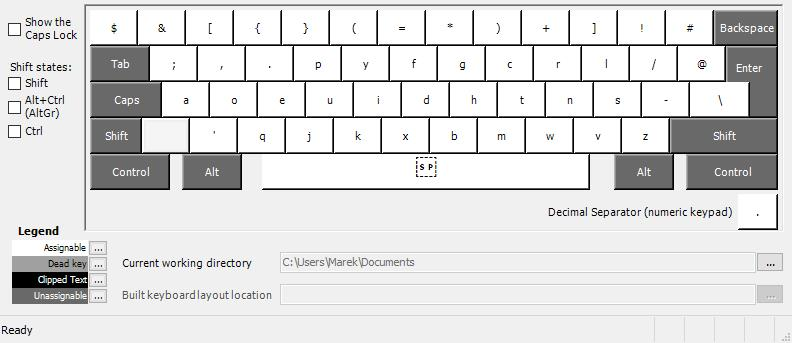
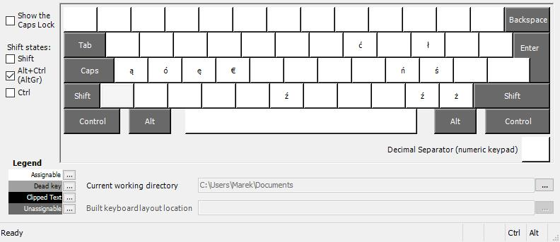
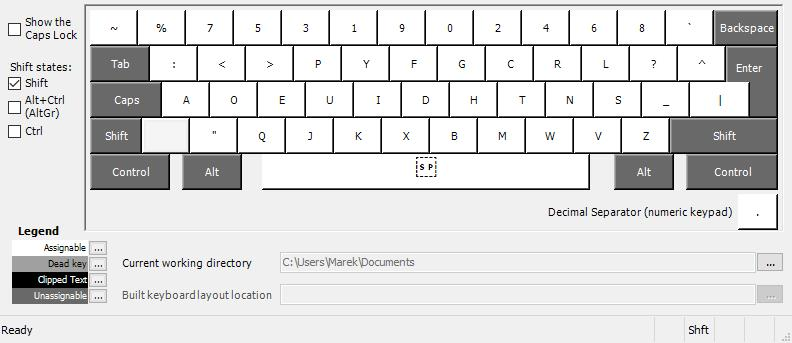

<h1 lang=pl>Polski Dvorak Programisty</h1>
<h1 lang=en>Polish Programmer Dvorak</h1>

<small>Oryginalnie opublikowano pod kątem Linuksa 12 lutego 2014. Aktualizacja dla Windowsa 29 stycznia 2023.</small>

<small>Originally published for Linux on February 12, 2014. Updated for Windows on January 29, 2023.</small>

Po dość bolesnym rytuale przejścia, dvorak programisty okazał się dla mnie całkiem przyjemnym układem klawiszy. Jedeny problem, jaki napotkałem przez wiele lat użytkowania to brak jego obsługi pod Windowsem oraz w systemowej konsoli na większości dystrybucji (jedynie Ubuntu o to zadbało). Poniżej udostępniam przygotowane przez siebie pliki, które dodają jego obsługę w tych kilku sytuacjach.

After a rather painful rite of passage, the programmer's dvorak turned out to be quite a pleasant key layout for me. The only problem I've encountered over many years of use is its lack of support under Windows and in the system console on most distributions (only Ubuntu has taken care of this). Below I'm providing files I've prepared to add its support in these few situations.

<h3 lang=pl>Konsola Linuksa (znana też jako TTY)</h3>
<h3 lang=en>Linux console (a.k.a. TTY)</h3>

Pobierz plik <a href="dvorak-pl.map.gz">dvorak-pl.map.gz</a> oraz zapisz go w <code>/usr/share/kbd/keymaps/i386/dvorak/</code>. Do jednorazowego załadowania możesz teraz użyć polecenia <code>loadkeys dvorak-pl</code>, a aby utrwalić efekt (jeśli twoja dystrybucja korzysta z systemd), do pliku <code>/etc/vconsole.conf</code> dopisz <code>KEYMAP=dvorak-pl</code>.

Download <a href="dvorak-pl.map.gz">dvorak-pl.map.gz</a> and save it to <code>/usr/share/kbd/keymaps/i386/dvorak/</code>. You can now use <code>loadkeys dvorak-pl</code> for a one-time load, and to persist the effect (if your distribution uses systemd), append line <code>KEYMAP=dvorak-pl</code> to <code>/etc/vconsole.conf</code>.

<h3>Windows</h3>

W Windowsie nowe układy klawiatury to pliki .dll, które instalowane są w odpowiednich katalogach systemowych. Aby zainstalować przygotowany przeze mnie układ, pobierz <a href=dvp.zip>dvp.zip</a> i zainstaluj go uruchamiając <em>setup.exe</em>. Plik przygotowałem w programie MSKLC (Microsoft Keyboard Layout Creator), dostępnym na stronach Microsoftu, lub, dla wygody, <a href="MSKLC.zip">tu</a>. Jeśli chcesz zmodyfikować przygotowany przeze mnie układ, lub też ze względów bezpieczeństwa chcesz samemu skompilować pliki DLL, możesz posłużyć się źródłami mojego układu - <a href="dvp.klc">dvp.klc</a>.

In Windows, new keyboard layouts are .dll files that are installed in the appropriate system directories. To install the layout I prepared, download <a href=dvp.zip>dvp.zip</a> and install it by running <em>setup.exe</em>. I prepared it in MSKLC (Microsoft Keyboard Layout Creator), available on Microsoft's website, or, for convenience, <a href="MSKLC.zip">here</a>. If you want to modify the layout I prepared, or for security reasons you want to compile the DLL files yourself, you can use my layout sources - <a href="dvp.klc">dvp.klc</a>.

Układ klawiszy bez modyfikatorów:

Key layout without modifiers:

Układ klawiszy z prawym klawiszem Alt:

Layout with the right Alt key:

Układ klawiszy z klawiszem Shift:

Layout with the Shift key:

